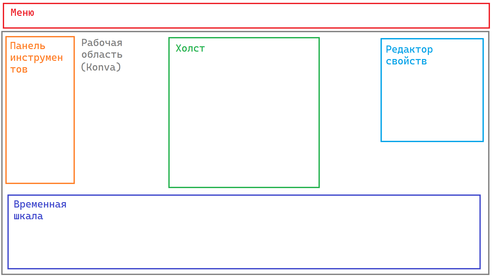

# База знаний

# UX

## Trello

[Ссылка на доску TODO](https://trello.com/b/zzVvtgpb/todo)

## Общее

Шейповая графика - способ создания векторной графики из набора математических формул, называемых "шейпами"

## Виды стикеров в Telegram Messenger

### [Анимированный](https://core.telegram.org/stickers#creating-animations)

- Формат .TGS
- Макс. размер: 64 КБ
- Размеры: 512x512 пикселей
- FPS: 30-60 FPS
- Макс. продолжительность: 3 секунды

### [Статический](https://core.telegram.org/stickers#static-stickers-and-emoji)

- Формат .PNG или .WEBP с прозрачным слоем
- Одна сторона должна быть размером ровно 512 пикселей, а другая сторона может быть 512 пикселей или меньше 

### [Видео](https://core.telegram.org/stickers#video-stickers-and-emoji)

- Формат .WEBM с кодеком VP9 и альфа-каналом (прозрачность является временным требованием)
- Макс. размеры: 512x512 пикселей , хотя бы одна сторона изображения должна быть 512 пикселей
- Макс. продолжительность: 3 секунды
- FPS: 30
- Макс. размер: 256 КБ
- Видео не должно иметь звукового потока
- Видео должно быть зациклено для оптимального взаимодействия с пользователем

## Lottie Json и dotLottie

[Lottie JSON](https://lottiefiles.ru/what-is-lottie/) (.json) - это формат файлов, используемый для создания Lottie-анимаций. Он содержит информацию о кадрах анимации, путях и свойствах объектов, а также описывает взаимодействие между объектами.

[dotLottie](https://dotlottie.io/) (.lottie) - это формат файлов с открытым исходным кодом, который объединяет один или несколько файлов Lottie и связанные с ними ресурсы в один файл. Они представляют собой ZIP-архивы, сжатые методом сжатия Deflate, и имеют расширение файла ".lottie".

## Формат TGS (Gzip)

Формат файла .TGS используется для анимированных стикеров в Telegram Messenger размером менее 30 КБ. 
Файлы TGS представляют собой архивы Gzip, содержащие данные Lottie.

### Требования:
- .TGS создан на основе Lottie (набор ограничений на исходный формат + gzip сжатие (библиотека zlib), уточнить)

- Размер холста 512х512 пикселей
- Объекты не должны покидать холст.
- Продолжительность анимации не должна превышать 3 секунд.
- Все анимации должны быть зациклены.
- Размер конечного файла после рендеринга плагином Bodymovin (создает файл формата Lottie) не должен превышать 64 КБ.
- Все анимации должны работать со скоростью 60 кадров в секунду.

## [Стикеры ВК](https://www.youtube.com/watch?v=3eKktYjUb1w)

- Стикеры ВК - это векторная + шейповая анимация на альфа-канале

- Создаются в After Effects (motion design) 

- Плагины After Effects
  - Bodymovin - позволяет экспортировать анимированные векторные и графические элементы в формат JSON

- Время выполнения <= 5 сек, в идеале - 2 сек 

## Инструменты

1. **TypeScript**

2. **React**

3. **Redux**

4. **Axios**

5. **Konva** - библиотека для рендеринга 2D-графики на HTML canvas

6. **pako** - библиотека сжатия данных, предоставляет функции для сжатия и распаковки данных в форматах gzip, deflate и zlib

7. **Lottie** - библиотека для воспроизведения анимаций в форматеLottie

## Идеи, мысли, замечания

- Авторизация пользователя нужна для:
  - Хранение исходников стикеров
  - Получение статистики по стикерам (web.telegram.org - реализована авторизация по qr-коду и СМС, [Telegram Oath](https://core.telegram.org/widgets/login))

- Пользовательские эмодзи

- Уникальный URL для текущего состояния (можно вернуться к прошлым действиям/расшарить)
- [Посмотреть зависимости фигмы](https://www.figma.com/open-source/)
- Режим обучения
- БольшАя часть функционала Adobe After Effects не поддерживается форматом .TGS (клавиши автобезье, выражения, маски, эффекты слоев, изображения, твердые тела, тексты, 3D-слои, слияние контуров, звездные фигуры, градиентные штрихи, повторители, растяжение времени, ремаппинг времени, автоориентированные слои)
- Интеграция с yoomoney.ru
- Cloudflare
- 

## Рассмотреть

- 
- 

## Проблемы

- Могут ли стикеры публиковаться от имени сервиса, если, да, то как валидировать?

- Возможные варианты для промежуточного формата редактора (.svg, .webm)

## Референсы

- https://www.haikuanimator.com/ 
- https://editor.lottiefiles.com/ (SVG)
- https://editor.method.ac/ (SVG)
- https://github.com/scaleflex/filerobot-image-editor#react-example (canvas)

## Полезные ссылки

- [Cоздание анимированных стикеров](https://vc.ru/design/651377-kak-ya-sozdayu-animacii-dlya-telegram)

- [Про стикеры ВК](https://vk.com/@kazzzak-v-ocherednoi-raz-o-tom-kak-sdelat-stikery-vkontakte)

- [Документация по телеграмм-стикерам](https://core.telegram.org/stickers)

- [Инструкция по созданию анимированных стикеров с исходниками (наглядный стекерпак, но без сгибов)](https://vc.ru/life/77593-kak-sdelat-animirovannye-stikery-esli-vy-ne-dizayner-ne-vkladyvaya-dengi)

- [freepik](ru.freepik.com) - бесплатные ассеты

- [Описание .TGS формата](https://docs.fileformat.com/ru/compression/tgs/#:~:text=Telegram)

- [Интеграции Lottie с инструментами](https://lottiefiles.com/integrations)

- [Test & Convert Lottie JSON to Telegram Sticker](https://lottiefiles.com/preview/telegram)

  - [tgskit](https://github.com/LottieFiles/tgskit)

- [lottie-editor](https://michielp1807.github.io/lottie-editor)

  - [sources: lottie-editor](https://github.com/MichielP1807/lottie-editor/blob/532feba04e39854321772cf4257e1c3aa2bab8de/src/components/PreviewArea.vue#L36)

